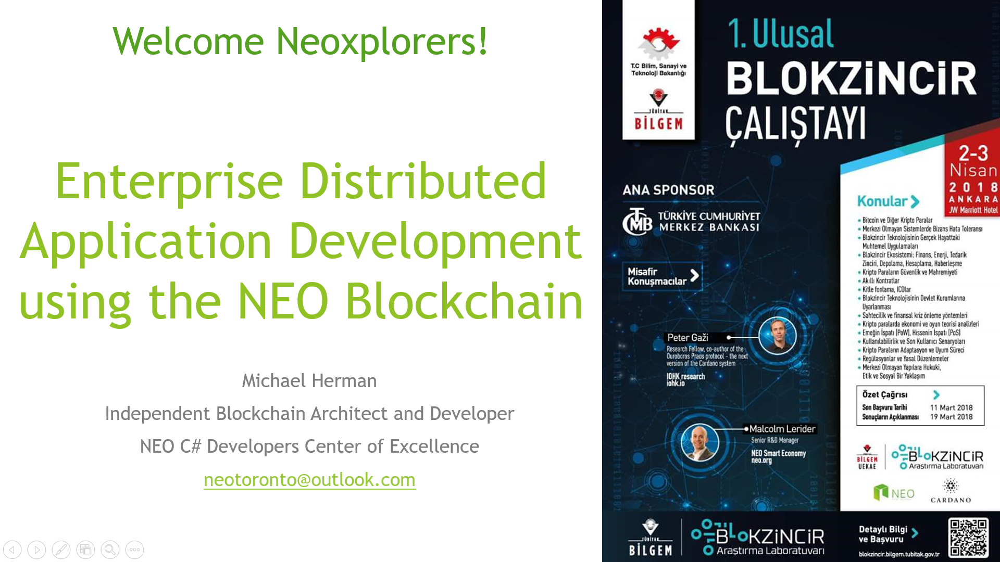

# Workshop for programming smart contracts with .NET, C# and Visual Studio

[NEO Blockchain C# Developers Center of Excellence](https://github.com/mwherman2000/neo-csharpcoe/blob/master/README.md)

The `neo-csharpcoe` project is an "umbrella" project for several initiatives related to providing tools and libraries (code), frameworks, how-to documentation, and best practices for enterprise application development using .NET/C#, C#.NEO and the NEO Blockchain software platform.

The `neo-csharpcoe` is an independent, free, open source project that is 100% community-supported by people like yourself through your contributions of time, energy, passion, promotion, and donations.  

To learn more about contributing to the `neo-csharpcoe`, click [here](https://github.com/mwherman2000/neo-csharpcoe/blob/master/CONTRIBUTE.md).

## Workshop for programming smart contracts with .NET, C# and Visual Studio

The original idea as well as the structure, and content of this workshop was created by Chris Hager (@metachris) for the NEO Python community: [Workshop for programming smart contracts with Python (python-smart-contract-workshop)](https://github.com/CityOfZion/python-smart-contract-workshop) ([https://github.com/CityOfZion/python-smart-contract-workshop](https://github.com/CityOfZion/python-smart-contract-workshop)).

This C# version of the workshop, [Workshop for programming smart contracts with .NET, C# and Visual Studio (csharp-smart-contract-workshop)](https://github.com/mwherman2000/csharp-smart-contract-workshop) ([https://github.com/mwherman2000/csharp-smart-contract-workshop](https://github.com/mwherman2000/csharp-smart-contract-workshop)), is a parallel effort based on Chris's original [workshop content](https://github.com/CityOfZion/python-smart-contract-workshop) (March 2018).

### Purpose

TODO  

### Goals, Non-Goals and Assumptions

TODO

### Principles

* Provide reliable documentation: timely, accurate, visual, and complete
* Save as much of a person's time as possible

### Drivers

TODO

## Content

### Presentation

* [Slides](https://goo.gl/3zve4E)
* [Links, Infos and Resources](https://goo.gl/SRw1nd) <-- this document has a lot of information and links, be sure to take a look!
* [Video: Introduction to Smart Contracts with Python 3.6 on the NEO Platform](https://youtu.be/ZZXz261AXrM) (by Tom Saunders) -- must watch video, introduction into neo-python and neo-boa
* [Workshop Agenda](https://github.com/CityOfZion/python-smart-contract-workshop/blob/master/Workshop-Agenda.md)
* [Video of this workshop at DevCon 2018](https://www.youtube.com/watch?v=sk8tu1uqRDI)

If you have any issues or ideas for improvements, please leave your feedback on the [GitHub repository](https://github.com/CityOfZion/python-smart-contract-workshop) and on the [NEO Discord](https://discord.gg/R8v48YA).

## Steps in the workshop

1. Setup [neo-python](https://github.com/CityOfZion/neo-python) and a [neo-privatenet](https://hub.docker.com/r/cityofzion/neo-privatenet/) Docker container [optionally with neoscan](https://hub.docker.com/r/cityofzion/neo-privatenet)
2. First smart contract, just printing "Hello World": [1-print.py](https://github.com/CityOfZion/python-smart-contract-workshop/blob/master/1-print.py)
   * Learn using neo-python's `build` command with the `test` argument
   * Test differences between Log and Notify
2. First smart contract using `print`, `Runtime.Log` and `Runtime.Notify`: [2-print-and-notify.py](https://github.com/CityOfZion/python-smart-contract-workshop/blob/master/2-print-and-notify.py)
   * Learn using neo-python's `build` command with the `test` argument
   * Test differences between Log and Notify
3. Basic smart contract using storage: [3-storage.py](https://github.com/CityOfZion/python-smart-contract-workshop/blob/master/3-storage.py)
   * Storage is one of the key components of most smart contracts
   * Everything is handled as bytes
   * Learn about `debugstorage on/off/reset`
4. A domain registration smart contract: [4-domain.py](https://github.com/CityOfZion/python-smart-contract-workshop/blob/master/4-domain.py)
   * users can query, register, transfer and delete domains
   * important concept: checking of ownership
5. NEX ICO template: https://github.com/neonexchange/neo-ico-template

**Note**: Inside neo-python's `prompt.py` you need to run `config sc-events on` to see any kind of notifications of the examples!

## Recommended Setup

Linux or Mac is recommended, and you need Python 3.6+. If you are using Windows, either setup a VM or use the Linux Subsystem (see also [here](https://medium.com/@gubanotorious/installing-and-running-neo-python-on-windows-10-284fb518b213) for more infos).

Clone neo-python and setup everything as described in the README. Then create a symlink of this workshop folder to `neo-python/sc`, which makes it easier to import, build and execute the smart contracts in this workshop.

Always work with a private network with this Docker image: https://hub.docker.com/r/cityofzion/neo-privatenet
You can also easily run the private network with neoscan - just use
[this Docker compose file](https://github.com/slipo/neo-scan-docker/blob/master/docker-compose.yml):

    $ wget https://raw.githubusercontent.com/slipo/neo-scan-docker/master/docker-compose.yml -O docker-compose-neoscan.yml
    $ docker-compose -f docker-compose-neoscan.yml up

See [here](https://github.com/slipo/neo-scan-docker) for more information.

## Typical method signatures

    # These two are just examples for playing around and experimenting:
    def Main():
    def Main(operation):

    # This is how most real smart contracts look like:
    def Main(operation, args):

See also: [parameter & return value types](https://github.com/neo-project/docs/blob/master/en-us/sc/tutorial/Parameter.md)

## Often used imports

    from boa.interop.Neo.Runtime import Log, Notify
    from boa.interop.Neo.Storage import Get, Put, GetContext
    from boa.interop.Neo.Runtime import GetTrigger,CheckWitness
    from boa.builtins import concat, list, range, take, substr

## Often used `build` commands

    neo> build sc/1-print.py test 07 05 True False
    neo> build sc/2-print-and-notify.py test 07 05 True False
    neo> build sc/3-storage.py test 07 05 True False
    neo> build sc/4-domain.py test 0710 05 True False query ["test.com"]

## Useful code snippets

* [neo-boa examples](https://github.com/CityOfZion/neo-boa/tree/master/boa_test/example)
* https://github.com/neonexchange/neo-ico-template
* https://github.com/neo-project/neo/wiki/Network-Protocol

#### Timestamps

You can get the last block timestamp from the blockchain with this code.

    def now():
        height = GetHeight()
        current_block = GetHeader(height)
        return current_block.Timestamp

Might not work with neo-boa 0.2.2, downgrade to 0.2.1 (see also https://github.com/CityOfZion/neo-boa/issues/35).

#### Random numbers

See https://medium.com/proof-of-working/coz-first-dapps-competition-dapp-review-3a6b284afaef#414c
